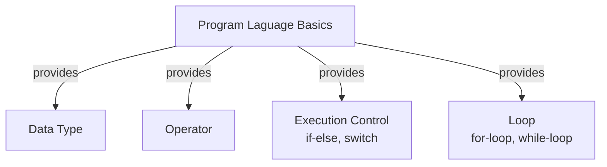

<h1>Java Class Notebook</h1>
<h1>Java Class Notebook</h1>

## Getting Started

* Check Java JDK installation
```DOS
java -version
javac -version
```
* install JDK
* install Eclipse
* install VS Code
  
## Questions and Answers

❓How do I create new Java Project in Eclipse?

✔️ Right-click Explore New > New > Java Project > Enter Name > [Finish]

❓How do I create new package?

✔️

❓How do I create a new Java class?

✔️

❓How do I run Java class?

✔️There is more than one way to run a class. 
1. One way is to click the green play button on the toolbar.
2. Another way is to right click and click "run as."
3. There even is a run tab on the menu bar!

* [HelloWorld.java](../src/../davidci/src/com/huaxia/davidci/HelloWorld.java)


## Print
* [Print.java](../src/../john/src/com/huaxia/john/Print.java)

## Variable Naming
1. variable name cannot start with number
2. variable can only start with letter and combine with letter and number a~z, A~Z, 0~9, and _, no other special characters allowed.
3. cannot use reserved java key words and existing class name for variable name.
   
## Comment

## Data Type

## Operator

## Execution Control

## Loop
