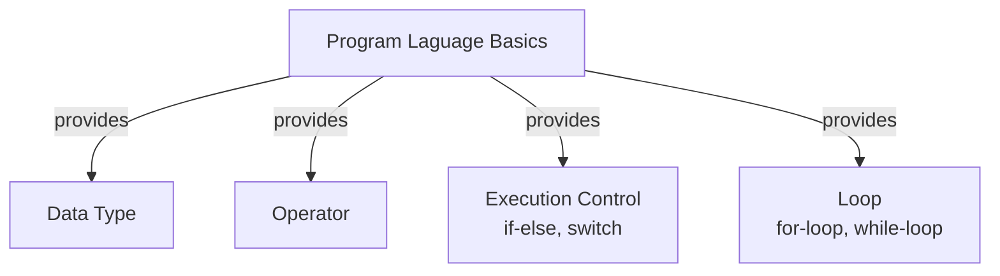

<h1>Java Class Notebook</h1>

## Getting Started

[Java API document] (https://docs.oracle.com/javase/8/docs/api/)

* Check Java JDK installation
```DOS
java -version
javac -version
```
* install JDK
* install Eclipse
* install VS Code
  
## Questions and Answers

❓How do I create new Java Project in Eclipse?

✔️Right-click Explore window ⟹ New ⟹ Java Project ⟹ enter name ⟹ [Finish]

❓How do I create new package?

✔️Right click your sourecode(src) 

❓How do I create new Java class?

✔️

❓How do I run Java class?
✔️There are more then one way to run java class:
1. Click the green run icon on toolbar;
2. Right-click Enditor window ⟹ Run As... ⟹ Java Application
3. Run menu ⟹ Run As... ⟹Java Application


* [HelloWorld.java](../src/../davidci/src/com/huaxia/davidci/HelloWorld.java)

1. Public modier on class is not important at this moment

2. remove public modifier on main() method. (That would make a runtime error)
   
❗️⚡️main() method must be public

3. remove static modifier on main() method. (that also made a runtime error)

❗️⚡️main() method must be static

4. remove void from main() method. (this would make a compiler error)

main() method has void return type means returns nothing

5. Change main() method return to int, and return 1, (that makes a runtime error)

6. change main() method to main1() gives runtime error

7. changing argument type from String[] to String will give error.

8. you can change the argument name!

✔️main() method is special

✔️Signature of main method includes name; argument (type, number of arguments); may be return type and modidifeir.

✔️the signature os main() method cannot be changed.



## Print
* [Print.java](../src/../john/src/com/huaxia/john/Print.java)

## Variable Naming
1. variable name cannot start with number
2. variable can only start with letter and combine with letter and number a~z, A~Z, 0~9, and _, no other special characters allowed.
3. cannot use reserved java key words and existing class name for variable name.


## Comment

1. single line comment
2. multiple line comment
   
❓ Why do I need comment?

1. document my code
## Data Type
[](../davidci/src/com/huaxia/davidci/DataType.java)
## Operator

## Execution Control

## Loop