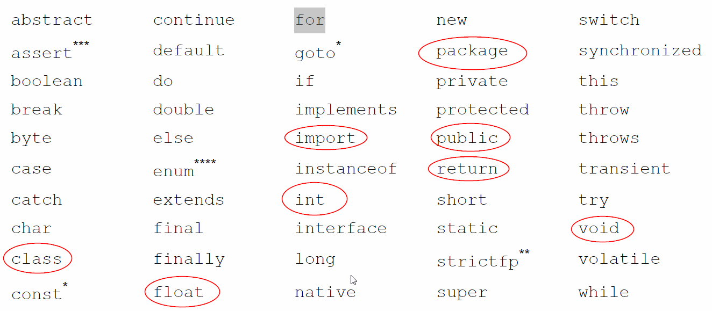

<h1>Java Class Notebook</h1>
- [Getting Started](#getting-started)
- [Questions and Answers](#questions-and-answers)
- [Print](#print)
- [Variable Naming](#variable-naming)
- [Comment](#comment)
- [Data Type](#data-type)
- [Operator](#operator)
- [Loop](#loop)
- [Execution Control](#execution-control)
- [Array](#array)
- [ArrayList](#arraylist)
- [Simple Math](#simple-math)
- [Try-Catch Block](#try-catch-block)
- [class](#class)
  - [class basic](#class-basic)
  - [constructor](#constructor)
## Getting Started

[Java API document] (https://docs.oracle.com/javase/8/docs/api/)

* Check Java JDK installation
```DOS
java -version
javac -version
```
* install JDK
* install Eclipse
* install VS Code
  
## Questions and Answers

❓How do I create new Java Project in Eclipse?

✔️Right-click Explore window ⟹ New ⟹ Java Project ⟹ enter name ⟹ [Finish]

❓How do I create new package?

✔️Right click your sourecode(src) 

❓How do I create new Java class?

✔️

❓How do I run Java class?
✔️There are more then one way to run java class:
1. Click the green run icon on toolbar;
2. Right-click Enditor window ⟹ Run As... ⟹ Java Application
3. Run menu ⟹ Run As... ⟹Java Application


* [HelloWorld.java](../src/../davidci/src/com/huaxia/davidci/HelloWorld.java)

1. Public modier on class is not important at this moment

2. remove public modifier on main() method. (That would make a runtime error)
   
❗️⚡️main() method must be public

3. remove static modifier on main() method. (that also made a runtime error)

❗️⚡️main() method must be static

4. remove void from main() method. (this would make a compiler error)

main() method has void return type means returns nothing

5. Change main() method return to int, and return 1, (that makes a runtime error)

6. change main() method to main1() gives runtime error

7. changing argument type from String[] to String will give error.

8. you can change the argument name!

✔️main() method is special

✔️Signature of main method includes name; argument (type, number of arguments); may be return type and modidifeir.

✔️the signature os main() method cannot be changed.


## Print
* [Print.java](../src/../john/src/com/huaxia/john/Print.java)

## Variable Naming
1. variable name cannot start with number
2. variable can only start with letter and combine with letter and number a~z, A~Z, 0~9, and _, no other special characters allowed.
3. cannot use reserved java key words and existing class name for variable name.



## Comment

1. single line comment
2. multiple line comment
   
❓ Why do I need comment?

1. document my code
## Data Type

[](../davidci/src/com/huaxia/davidci/DataType.java)
* 2 based number(binary number)
$$ myByte = 1\cdot2^5+1\cdot2^4+4+0*2^3+0*2^21\cdot2^1+1\cdot2^0 $$= 32+ 16 + 2 +1 
* 10 based number(decimal number)
$$ 602 = 6\cdot10^2 + 02\cdot10^0$$

* primitve data type: boolean, byte, int, float, double...
* Java defined data type: String
* Developer defined data type: Hello, Print
## Operator
* [Operators](../davidci/src/com/huaxia/davidci/Operator.java)
* arithmetic operator: +, -, *, /, %
* assignment operator: =, +=, -=, *=, /=, %=
* binary operator: ++, --, increase or decrease the variable value by 1
* comparison operator: >, <, >=, <=, ==, !=, always return boolean which are true or false
* binary operator: ++, --, increase or decrease the variable value by 1
* comparison operator: >, <, >=, <=, ==, !=, always return boolean which are true or false
*  logical operator: && and, || or, ! not; return only true or false
*  ternary operator: combination of ? and :
*  


## Loop
[For-loop, for each, continue, break](../davidci/src/com/huaxia/davidci/Loop.java)
* continue on for-loop

* Break on for loop

## Execution Control


## Array

❓What is a array in Java?

✔️An array in Java is a set of varibles referenced by
using a single varible name combined with an index number

[Array.java](../davidci/src/com/huaxia/davidci/Array.java)
## ArrayList
❓What is ArrayList in java?

✔️
1. create ArrayList
2. add item in ArrayList
3. remove item from ArrayList
4. sort ArrayList
```mermaid
A[Java Program]
B[class]
C[Method]
D[Class Method]
E[CLass atribute]

A--include--> B & C
B--include--> D & E
````

[](../src/com/huaxia/davidci/../../../../davidci/bin/com/huaxia/davidci/ArrayList.class)

## Simple Math

[add(), circleMath()](../davidci/src/huaxia/../com/huaxia/davidci/SimpleMath.java)

## Try-Catch Block
❓What is try-catch block?
✔️Try-catch block is a java code black to catch exception when something unexpected happens.

❓Why do I need try-catch
✔️It is possible something wrong happens, you need to catch it to avoid the application blowing up.

1. When r<0 we need to throw Exception. (throw expetion under condition, and then we throw it in mathod defintion)
2. to handle Excpetion for a method, we can 1: rethrow it 2: Try-catch it


[](../src/../davidci/src/com/huaxia/davidci/TryCatch.java)

## class
### class basic
❓What is Java Class?
✔️A java classi s the blueprint from which individual objects are created. It is a Java code block which define attributes, methods, and constructors that can be used in creating instnce of the class.

*[](../davidci/src/com/huaxia/davidci/SimpleClass1.java)
1. create instance of SimpleClass1 by default constructor
2. print out the instance vby defualt toString() method
3. and other method such as equal()

❓What is object class
✔️

❓what does object class provide us?
✔️

* [Override toString() method, but connot diffentiate differnt objects](../davidci/src/com/huaxia/davidci/SimpleClass2.java)

*[Contructor,field, override toString](../davidci/src/com/huaxia/davidci/SimpleClass3.java)

### constructor
❓What is constructor?
✔️

❓What can constructor do?
✔️

[Setter/Getter](../davidci/src/com/huaxia/davidci/SimpleClass3.java)

1. constustor look like method without return type.
2. it uses class name as method name
3. constructor can have arguments
4. it is used to create instance of the class
5. we can use public, prvitate, defualt(no modifier) modifier 
6. public modifier make the construstor available on all packages
7.no modifier make the constructor availble only in same package
8. private odifier make the constructor only in the same class
9. one develpoer fine own constuctor, the defualt constuctor will no long work!

##Interface

❓What is interface?
✔️ An interface is declaration colloction of methods without implenmentations and constant fields.

❓How do I create interface in Eclipse?
✔️Right-click package name > New > Interface

❓What is abstract method?
✔️only declare method signture without implementations.

[Occupation.java](../src/../davidci/src/com/huaxia/davidci/Occupation.java)

1. cannot instantiate an interface object.
2. create concrete class which implements the interface
    -[Test.java](../src/../davidci/src/com/huaxia/test/Test.java)
    -[Teacher.java](../src/../davidci/src/com/huaxia/davidci/Teacher.java)
3. can define constant fields
4. can use **instasnceof** to test object type
5. can also use getClass().getName to get object type for name

❓What is a concrete class?
✔️Is a class that has all abstract methods implemented
1 if you defined your own constructor without using super() keyword, you will need to define your own default constructor.
2. subclass inherits all features from superclass  but constructor

❓What is an abstract class?
✔️we use **abstract** keyword tto define an abstract class. abstract class allow abstact mothd defined in it.
1. cannot insantiate an abstract class.
2. can define its own abstract method by **abstract** keyword.
3. can define methods with implementations.
4. can define protected feidls which can be used directly 

[Test](../davidci/src/com/huaxia/test/Test.java)